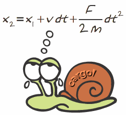

Cargol
======

A short and sequential molecular dynamics code

This molecular simulation code comes without any guaranties. The main
goal of this code is to quickly take a tour of a molecular dynamics program and
to see the diffrent parts if it.

This code is under GPL Licence .

installation
------------

L'archive contient les sources dans le dossier src/. Les fichiers
d'entête sont dans le dossier include/. A la fin de la
compilation les fichiers objets seront dans le dossier obj et 
l'exécutable sera à la racine du code. Voici la procédure :

  1.  unzip cargol.zip
  2.  cd cargol/
  3.  make install (ou make)
   
Dans le dossier cargol_struct vous trouverez d'autres sources de
cargol qui ont été écrites dans un esprit différents. Dans src, le 
code utilise des variables globales, déclarées dans globales.h 
et accessibles à toutes les fonctions car le fichier extern.h est
inclu dans tous les fichiers. Dans cargol_struct, les variables
globales sont regroupées dans des structures (structures.h) et les
structures sont passées aux fonctions en paramètre. Les deux codes
devraient donner les mêmes résultats, seulent l'écriture est 
différente.

utilisation
-----------

Le dossier inputs/ contient des exemples de fichiers input. 
Le fichier input_all contient tous les mots clefs. La
documentation est encore très sommaire.

Pour utiliser le programme :

  cargol -help 
  	affiche une aide sommaire

  cargol input
  	exécute le calcul demandé dans le fichier input. Le nom 
	du fichier d'input n'a pas d'importance.

Bonne simulation !

Germain

